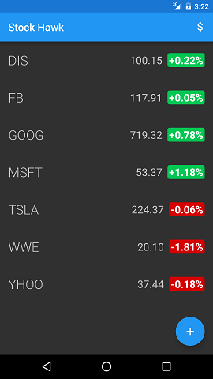
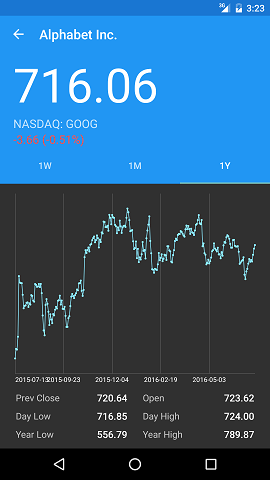
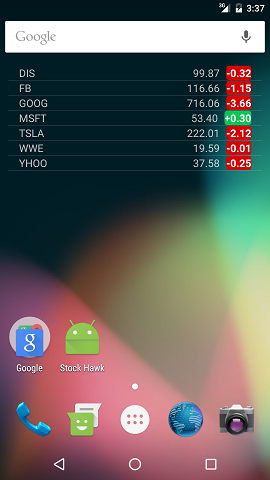
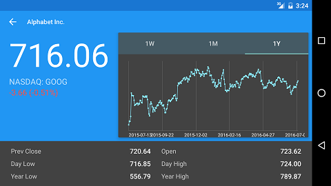
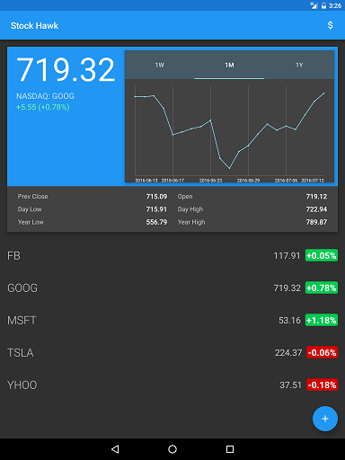
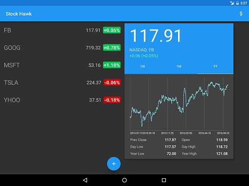

# StockHawk
This Android App allows users to follow and track their favorite publicly traded companies on the stock market.

Stock data is gathered from Yahoo's YQL developers console. https://developer.yahoo.com/yql/console/

 - Users can add their favorite company to follow by tapping the '+' floating action button.  The stock is saved locally to a SQLite database on the device.
 - Users can remove a stock from the list by swiping it off the screen.
 - Users can view the stock performance changes in dollars or percentage.
 - By tapping on a saved stock, users will be a presented with a detailed screen of:
    - the stock's current performance
    - past performance
    - graph of performance history (1 week, 1 month, 1 year)
 - Users can add an interactive widget to follow their saved stocks on the homescreen.  Clicking a stock from the widget will bring them to the detailed view of the stock.
 - App is optimized for phone and tablets.

-Phone

-Tablet 

